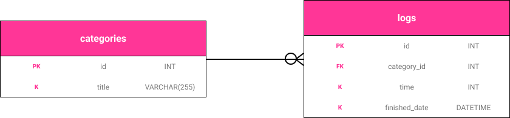
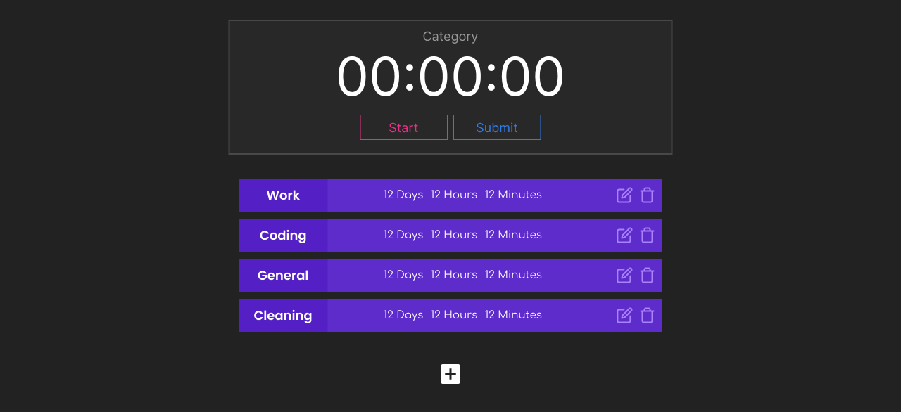
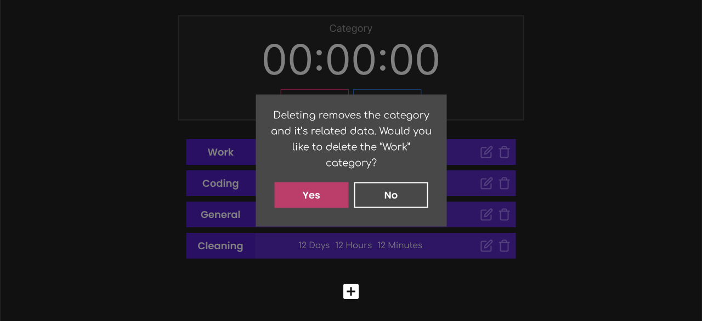
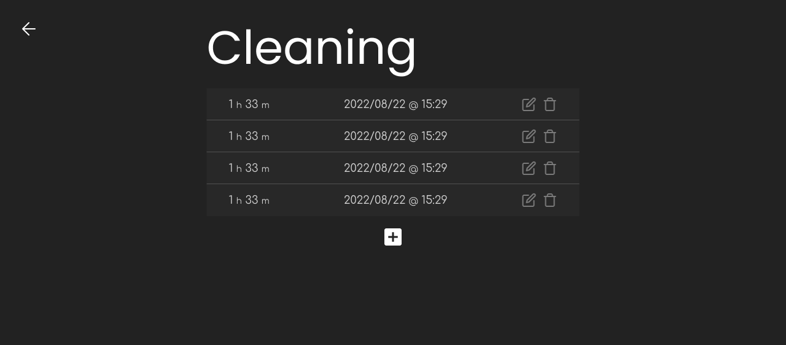
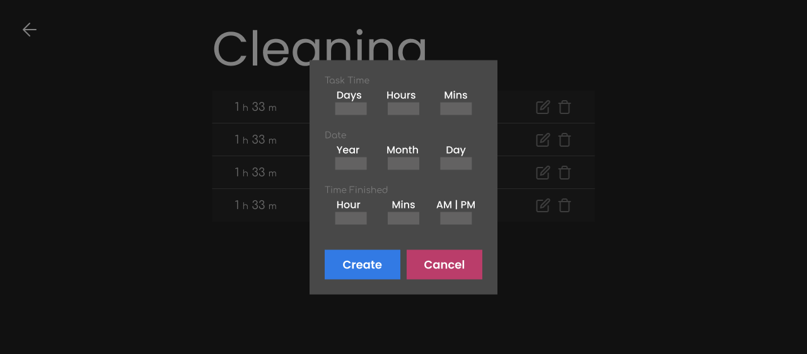
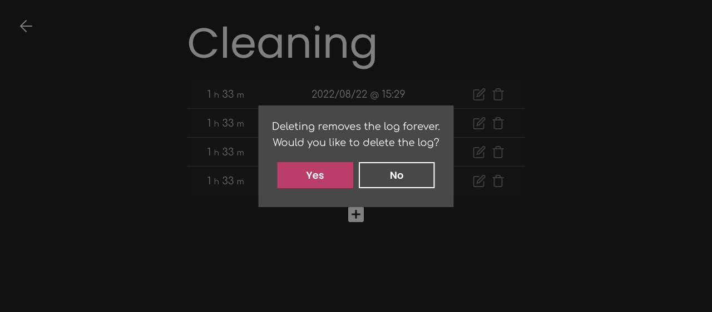

# Time Tracker

## Description

Time Tracker is an application that allows you to track and visualize how much time you've spent. You create categories and then select a category to put time into. You run the timer and hit complete when you don't want to track time anymore. Your time is then updated with the appropriate category. Your total time for each category is then displayed on the homepage. You can add or delete entries simply by clicking into a category. This page will allow you to create, update, or delete entries.

## Challenges
I expect creating a timer might pose a challenge. More specifically, tracking the time properly once the timer is paused. Also, authentication and seperating the data for different users.

## MVP
- Captures time from timer
- Ability to create categories
- Displays accumulated times
- CRUD actions for updating category items

## POST MVP
- Dark mode
- Export logs
- Select specific time periods
- Display data in charts
- Garden grows on how much time is added
- Mobile & Tablet Responsive design
- User creation
- User autherization


## Feature List
1. List of the apps functionality

## Entity Relationship Diagram


## API Endpoint Documentation

### Get All Categories
To retrieve all the categories make a `get` request to `https://ilja-time-tracker.herokuapp.com/api/categories`.

```js
// Route
axios.get('https://ilja-time-tracker.herokuapp.com/api/categories')

// Response
"results": [
  {
    "id": 4,
    "title": "Work",
    "total_time": null
  },
  {
    "id": 24,
    "title": "Coding",
    "total_time": 50
  }
]
```

### Get Single Category
To retrieve a single category make a `get` request to `https://ilja-time-tracker.herokuapp.com/api/categories/:id`. `:id` can be the `id` of the category or the `title`. All category `id`s and `title`s are unique.

> If using the `title` to retreive a category please note that it is case sensitive. `Work` is not the same as `work`.

```js
// Request
axios.get('https://ilja-time-tracker.herokuapp.com/api/categories/4');
axios.get('https://ilja-time-tracker.herokuapp.com/api/categories/Work');

// Response
"results": [
  {
    "id": 4,
    "title": "Work"
  }
]
```

### Get Logs for a Category
To retrieve the logs to a category make a `get` request to `https://ilja-time-tracker.herokuapp.com/api/categories/:id/logs`. Again, we can use the `id` or `title` of the category in the path. If a category doesn't have any logs then `null` will be returned for the values.

```js
// Request
axios.get('https://ilja-time-tracker.herokuapp.com/api/categories/4/logs');
axios.get('https://ilja-time-tracker.herokuapp.com/api/categories/Work/logs');

// Response with no logs
"results": [
  {
    "category": "Work",
    "category_id": null,
    "log_id": null,
    "time": null,
    "finished_date": null
  }
]

// Request
axios.get('https://ilja-time-tracker.herokuapp.com/api/categories/24/logs');
axios.get('https://ilja-time-tracker.herokuapp.com/api/categories/Coding/logs');

// Response with logs
"results": [
  {
    "category": "Coding",
    "category_id": 24,
    "log_id": 4,
    "time": 50,
    "finished_date": "2022-08-24T12:00:00.000Z"
  },
  {
    "category": "Coding",
    "category_id": 24,
    "log_id": 24,
    "time": 13,
    "finished_date": "2022-08-25T02:20:20.000Z"
  }
]
```

### Creating a Category
To create a category make a `post` request to `https://ilja-time-tracker.herokuapp.com/api/categories`.

```js
// Syntax
{
  "title": "<title value>"
}

// Example
{
  "title": "Coding"
}

// Request
axios.post('https://ilja-time-tracker.herokuapp.com/api/categories', {
    title: 'Coding',
  })

// Response 
"category has been created"
```

### Updating a Category
To update a category make a `put` request to `https://ilja-time-tracker.herokuapp.com/api/categories`. You can use either the `id` or `title` to determine the category to update.

```js
// Syntax
{
  "new_title": "<title value>",
  "id": "<id of category>", 
  "title": "<title of category>"
}

// Example
{
  "new_title": "Coding",
  "id": 24,
  "title": "Codi",
}

// Request with id
axios.put('https://ilja-time-tracker.herokuapp.com/api/categories', {
  "new_title": "Coding",
  "id": 24,
})

// Request with title
axios.put('https://ilja-time-tracker.herokuapp.com/api/categories', {
  "new_title": "Coding",
  "title": "Codi",
})

// Response 
"category has been updated"
```

### Deleting a Category
To delete a category make a `delete` request to `https://ilja-time-tracker.herokuapp.com/api/categories`. You can use either the `id` or `title` to determine the category to delete.

```js
// Syntax
{
  "id": "<id of category>", 
  "title": "<title of category>"
}

// Example
{
  "id": 24,
  "title": "Coding",
}

// Request with id
axios.delete('https://ilja-time-tracker.herokuapp.com/api/categories', {
  "id": 24,
})

// Request with title
axios.put('https://ilja-time-tracker.herokuapp.com/api/categories', {
  "title": "Coding"
})

// Response 
"category has been deleted"
```


### Get All Logs
To retrieve all the logs make a `get` request to `https://ilja-time-tracker.herokuapp.com/api/logs`.

```js
// Request
axios.get('https://ilja-time-tracker.herokuapp.com/api/logs');

// Response
"results": [
  {
    "id": 4,
    "category_id": 24,
    "time": 50,
    "finished_date": "2022-08-24T12:00:00.000Z"
  },
  {
    "id": 24,
    "category_id": 4,
    "time": 77,
    "finished_date": "2022-08-24T12:56:00.000Z"
  },
  {
    "id": 34,
    "category_id": 4,
    "time": 23,
    "finished_date": "2022-08-25T03:05:00.000Z"
  }
]
```

### Get a Single Log
To retrieve a single log make a `get` request to `https://ilja-time-tracker.herokuapp.com/api/logs/:id`. `:id` is the `id` of the log to get.

```js
// Request
axios.get('https://ilja-time-tracker.herokuapp.com/api/logs/4');

// Response
"results": [
  {
    "id": 4,
    "category_id": 24,
    "time": 50,
    "finished_date": "2022-08-24T12:00:00.000Z"
  }
]
```

### Creating a Log
To create a log make a `post` request to `https://ilja-time-tracker.herokuapp.com/api/logs`.

```js
// Syntax
{
  "category_id": "<id of category log is referencing>",
  "time": "<number>",
  "finished_date": "<YYYY-MM-DD HH-MM-SS>",
}

// Example
{
  "category_id": 4,
  "time": 23,
  "finished_date": "2022-08-25 03:05:00"
}

// Request
axios.post('https://ilja-time-tracker.herokuapp.com/api/categories', {
  "category_id": 4,
  "time": 23,
  "finished_date": "2022-08-25 03:05:00"
})

// Response 
"log has been created"
```

### Updating a Log
To update a log make a `put` request to `https://ilja-time-tracker.herokuapp.com/api/logs`. You aren't required to update all the values at once. You only need to include the `id` and then the values you wish to update. The `finished_date` must be in this format `YYYY-MM-DD HH-MM-SS`.

```js
// Syntax
{
  "id": "<id of log to update>", 
  "category_id": "<id of new category>",
  "time": "<new time>",
  "finished_date": "<new finished date>",
}

// Example
{
  "id": 24,
  "category_id": 4,
  "time": 77,
  "finished_date": "2022-08-24 12:56:00"
}

// Request
axios.put('https://ilja-time-tracker.herokuapp.com/api/categories', {
  "id": 24,
  "category_id": 4,
  "time": 77,
  "finished_date": "2022-08-24 12:56:00"
})

// Response 
"log has been updated"
```

### Deleting a Log
To delete a log make a `delete` request to `https://ilja-time-tracker.herokuapp.com/api/logs`.

```js
// Syntax
{
  "id": "<id of log>", 
}

// Example
{
  "id": 24,
}

// Request
axios.delete('https://ilja-time-tracker.herokuapp.com/api/categories', {
  "id": 24,
})

// Response 
"log has been deleted"
```

## Wireframes

### Home Page
Home page for the app. It allows the user to start tracking their time with the timer. You select a category to have the time go to and press "start". Once the user is ready they can press submit to log their time. Each category starts with its name, then total time accumulated, and lastly icons to edit the logs of a category or to delete the entirely.







### Log Page
The log page is used for getting the various logs associated with a given category. Here we can add, update, or delete logs.








## Component Hierarchy
1. Wireframes should be broken into components which then should be described in a component hierarchy.

## Dependencies
link to any project dependencies (e.g. 3rd party APIs, libraries, linter, etc).

1. Create React App
2. Axios
